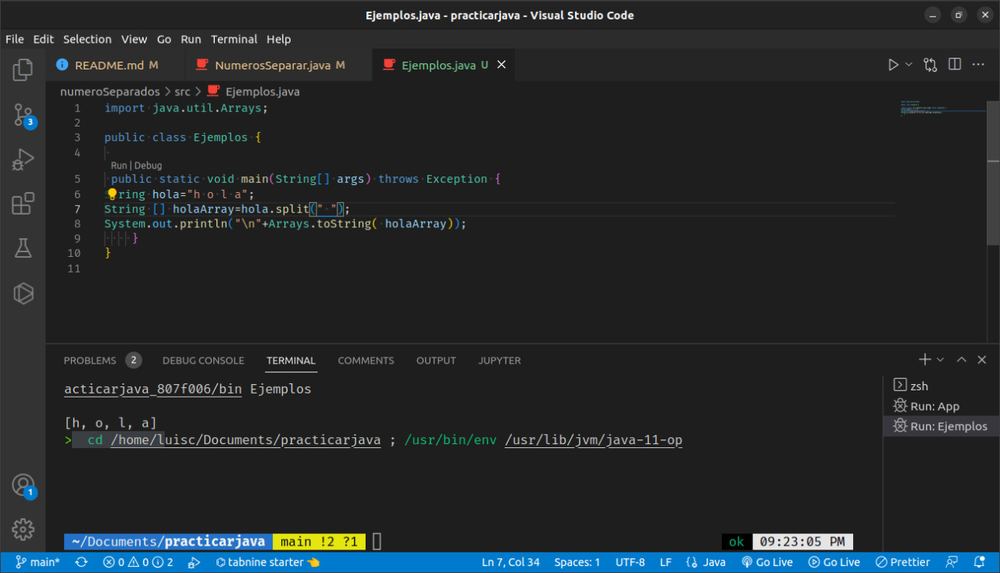
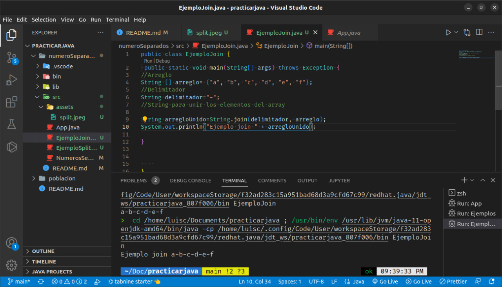

# Ejercicio 2.30- Documentación

## Separación de los dígitos en un entero

Escriba una aplicación que reciba del usuario un número compuesto por cinco dígitos, que separe este número en sus dígitos individuales y los imprima, cada uno separado de los demás por tres espacios.

# Solución del ejercicio

## 1. Analisis del problema

El problema tiene los datos de entrada, el proceso y su dato de salida respectivamente

- Datos de entrada

  - Se pide un número entero de 5 digitos pero se trabajará con números de diferentes digitos sea mayor o menor que 5 dígitos. Además que el signo menos de los números enteros negativos se tomará como un dígito

- Dato de salida
  - El número seperado por tres espacios. Ejemplo el número de entrada sería "42339" la salida sería "4 2 3 3 3 9"

- Proceso

  1. En este caso se usan los siguientes métodos:

  - split(). Este método convierte un string en un array. Recibe dos parametros
    los cuales son un expresión regular que se toma como base para separar el string y un limite sobre el tamaño que se quiera aplicar. Por ejemplo:
    
  - join() Este método convierte un array en un String. Recibe un delimitador y el array o una serie de cadena que se va a unir. Por ejemplo:
    

## 2. Diseño UML

Teniendo en cuenta el analisis anterior se puede abstraer que se necesita una clase que se representa con el siguiente diseño

## 3. Implementación

La implementación se encuentra en este repositorio de github. Para ejecutarlo:

1. git clone https://github.com/LuisC-web/practicarjava
2. Abrir proyecto en vscode
4. Acceder  la carpeta numeroSeparados
3. Entrar en carpeta src y ejecutar archivo App.java

## Testeo

Para ejecutar las pruebas de testeo se saldrá al ejecutar el programa un mensaje donde podrá o no aceptar los testeo. Si quiere ejecutar presione la tecla "y" de lo contrario "n"

### Creado por Luis Camargo Guzman-20221005086. Usuario github LuisC-web
